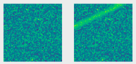
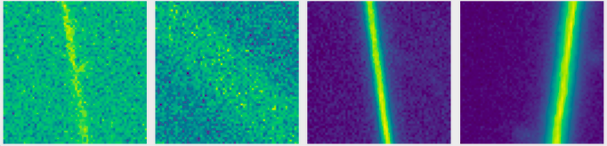

## Generating realistic synthetic streaks
With the number of space debris growing day by day, it is essential to be able to monitor them to ensure safety on earth and in space. 
What is proposed in this project is an automated method to improve the reality of synthetic satellite streaks  in astronomical images using a deep learning method: SimGAN. It is a type of generative adversarial network, specifically designed for image-to-image translation tasks. For this, pictures of space taken with an OmegaCAM camera on the VLT telescope in Chile are used.  The efficiency of the refinement is tested by comparing the segmentations obtained with a UNet trained on synthetic images and one trained with synthetic images refined by the SimGAN model. Unfortunately, no clear improvements are observed.
Example of png image provided by LASTRO containing a streak:
<p align="center">
  
 </p>

# Generate synthetic images from real fits images
It consists in artificially generating streaks which are then overlayed on real astronomical images. To get these backgrounds, fits images provided by
LASTRO are used. They do not have any streak in them. These fits images are mosaics, of 16000 x 16000 pixels, composed of 32 blocks of 2000 x 4000 pixels separated by NaN values. 

The user needs to provide different parameters:
* --i: path to the fits images
* --o: beginning of the name given to the generated synthetic images, their targets and array indicating wether or not a streak is present in the image
  
  Example: three arrays npy will be created with this lign of command:
  * multi_test_samples.npy: generated synthetic images. Images without streaks are real patches.
  * multi_test_targets.npy: grountruths corresponding to the generated images
  * multi_test_patch_targets.npy: array of binary values indicating wether or not a streak is present in each image
  The fits images used for the background were in the folder "/synthetic"
```
python generate_synthetic.py --i "synthetic/" --o "multi"
```
Example of generated synthetic streak and its background:
<p align="center">
  
  
</p>

# Get patches of real streaks
This part can not be reused if the user doesn't have access to the LASTRO images and to a csv file provided by LASTRO. In this csv is written 
if an image contains a streak or not and if yes the coordinates of the two extreme points of the streak. 
If the user has access to this, then he needs to provide:
* --i: path to the png images containing real satellite streaks
Example of command:
```
python simgan_training.py --i "images/" 
```
Example of patches obtained with LASTRO images:
<p align="center">
  
  
</p>
